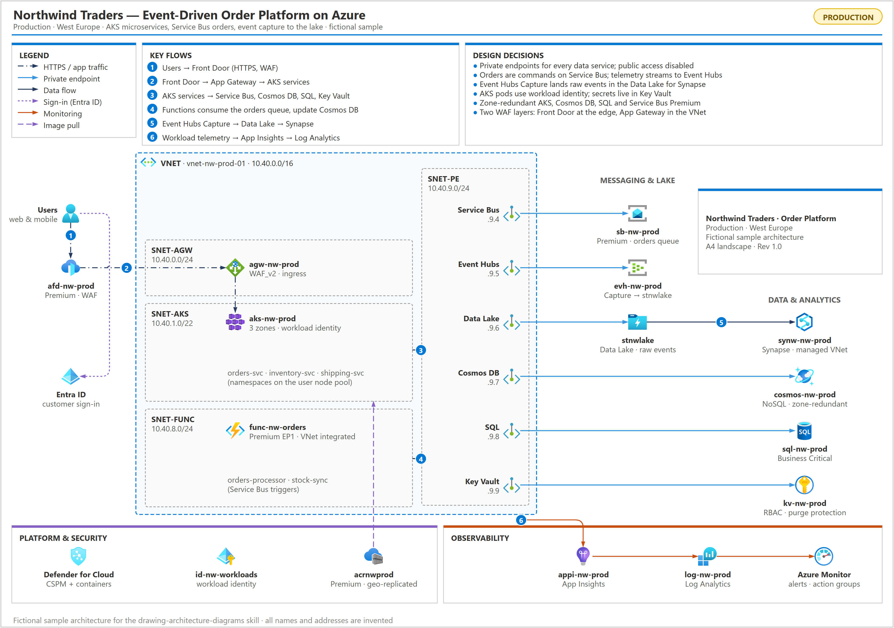

# drawing-architecture-diagrams

A [Claude Code](https://claude.com/claude-code) skill for producing **professional, print-ready architecture
diagrams** (Azure, AWS, GCP, network topology, hub-and-spoke, landing zones, private endpoints) as editable
**draw.io** files plus PNG and PDF.



The agent writes the diagram as a short Python script on top of a small design system, then iterates
**lint → render → look → fix** until the page is clean. Every rearrangement is a cheap re-run, and the result
has consistent typography (font 10 at print size), colour, spacing and connector routing.

## What's inside

| Path | Purpose |
|---|---|
| `SKILL.md` | When to use the skill, the workflow, layout bands, design rules, patterns and common mistakes |
| `scripts/archdiagram.py` | Design-system library: pages (A5/A4/A3), containers, subnets, panels, legend, numbered flows, observations, title block, edges; plus `lint` and `render` |
| `examples/event_driven_platform_a4.py` | Worked example (fictional Northwind Traders): event-driven AKS + Service Bus order platform on one A4 page |
| `references/icons.md` | Verified draw.io icon paths and how to find and verify new ones |
| `tests/selftest.py` | Checks that the example lints clean and that every lint rule fires |

**Lint** flags overlapping labels, labels outside the frame, titles covered by icons, icons that render as plain
boxes, oversized icons, ragged label baselines, cells hidden behind filled boxes, and wasted space (empty boxes,
sparse boxes, one-sided gaps, empty areas and empty bands). It is necessary, not sufficient: the skill always
requires viewing the rendered PNG.

## Install

```bash
git clone https://github.com/gjohnpaull/drawing-architecture-diagrams ~/.claude/skills/drawing-architecture-diagrams
```

Requirements: Python 3.9+ and [draw.io desktop](https://github.com/jgraph/drawio-desktop/releases) (used for
PNG/PDF export; set `DRAWIO=<path>` if it is not in a standard location).

## Use

Once installed, the skill loads automatically when you ask Claude Code for an architecture diagram. Example
prompts, by situation:

### From a live cloud environment
Claude inventories the resources first (Azure CLI / Resource Graph, AWS CLI, `gcloud`) and draws only what it verified.

- `Create an A4 architecture diagram of my Azure subscription "sub-prod-001".`
- `Diagram the resource group rg-payments-prod: VNets, subnets, private endpoints, DNS zones and data services.`
- `Draw the network topology of this landing zone - hub, spokes, peering, route tables and firewall next hops.`
- `Map every private endpoint in this subscription to its service and show which DNS zone resolves it.`
- `Visualise our AWS production VPC - subnets, NAT/Internet gateways, load balancers, ECS services and RDS.`

### From a description, notes or code
- `Draw an architecture diagram for this design: users hit Front Door, which routes to two App Services behind
  private endpoints; they use Azure SQL, Key Vault and Service Bus; Functions process the queue.`
- `Turn this Terraform folder into an architecture diagram on A4.`
- `Here is our solution design doc - produce the logical architecture diagram with numbered key flows.`
- `Diagram this Kubernetes platform: ingress, namespaces, services, managed databases and the CI/CD image flow.`

### From a reference image or house style
- `Create my architecture diagram so it looks like this reference image` (attach the image).
- `Match the layout of the attached whiteboard photo, but with our real resource names.`
- `Redraw this old Visio export in the same professional style.`

### Rearranging and polishing
- `Arrange the private endpoints in a two-row grid and line the services up under them.`
- `There is too much white space in the private endpoint subnet - tighten it.`
- `Move the legend and key flows into the empty margins.`
- `Make it look like it was designed by a professional architect.`
- `The Front Door line crosses the subnet labels - reroute it.`

### Print and page size
- `Fit this diagram on one A4 landscape page with every label at font size 10.`
- `This is too dense for A4 - give me an A3 version as well.`
- `It is a small system - use the smallest page that keeps text at size 10.`
- `Export the diagram as .drawio, a 300 dpi PNG and a PDF.`

### Findings and reviews
- `Add a Key Observations panel for public network access, missing DNS zones and orphaned resources.`
- `Mark every resource with public access enabled in red and show private ones as private.`
- `Show the numbered data flows and explain each one in a Key Flows panel.`

### Checking an existing diagram
- `Lint my diagram.drawio for overlapping labels and wasted space, then fix what it finds.`
- `Review this architecture diagram and tell me what a reviewer would flag.`

### Tips for good results
- Give it facts, not just names: SKUs, IP ranges, which service talks to which. It draws only what it can verify
  and marks anything inferred.
- Say the page size and font size you need up front (default: A4 landscape, font 10).
- Ask for changes by what you see ("the right column is empty", "labels collide under SQL"). Claude edits the
  build script and re-renders, so rearranging is quick.
- Keep the generated build script next to the diagram; rerun it after the environment changes.

Or use the library directly:

```python
from archdiagram import Diagram, lint_file, render
d = Diagram("A4L")
d.frame_title("Contoso - Production", "Web platform · West Europe", chip="PRODUCTION")
# ... containers, icons, panels, edges ...
d.save("out.drawio")
print(lint_file("out.drawio"))
render("out.drawio")          # out.png (3x) + out.pdf (page size)
```

```bash
python scripts/archdiagram.py lint out.drawio
python scripts/archdiagram.py render out.drawio
python tests/selftest.py
```

## Licence

MIT - see `LICENSE`. Icons are loaded from the draw.io icon libraries and remain subject to their own terms.
